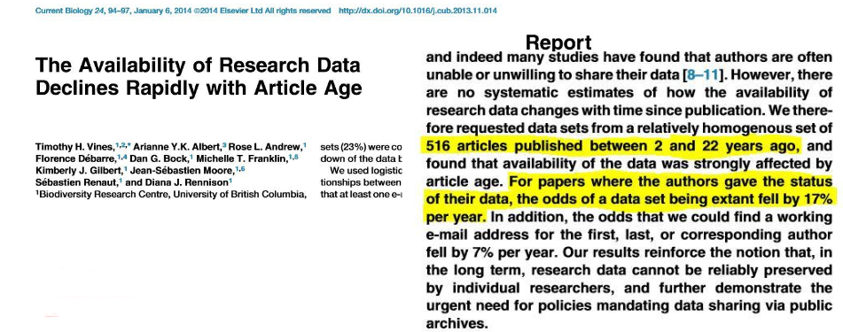
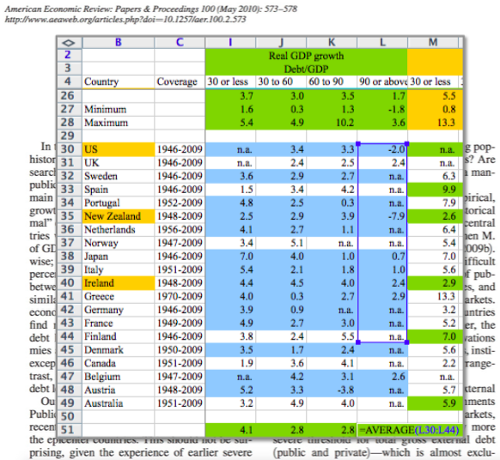
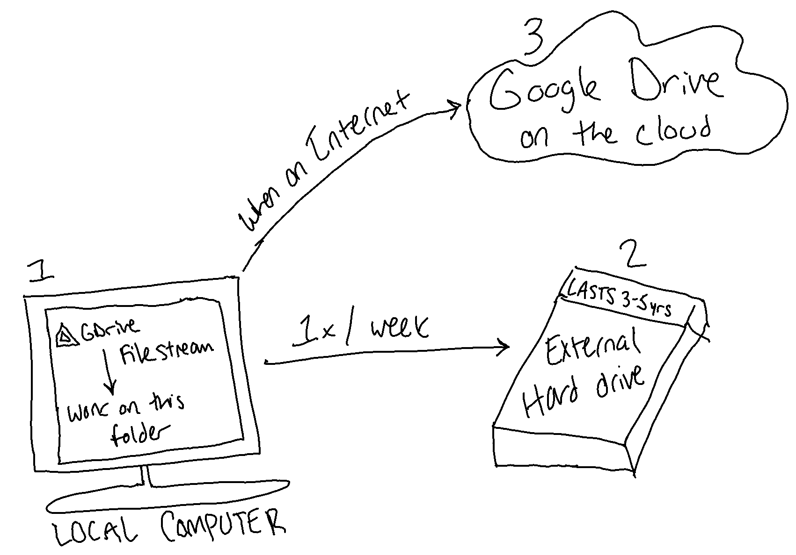
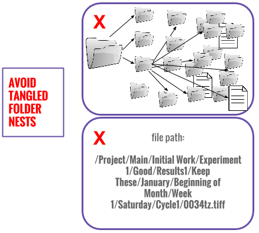
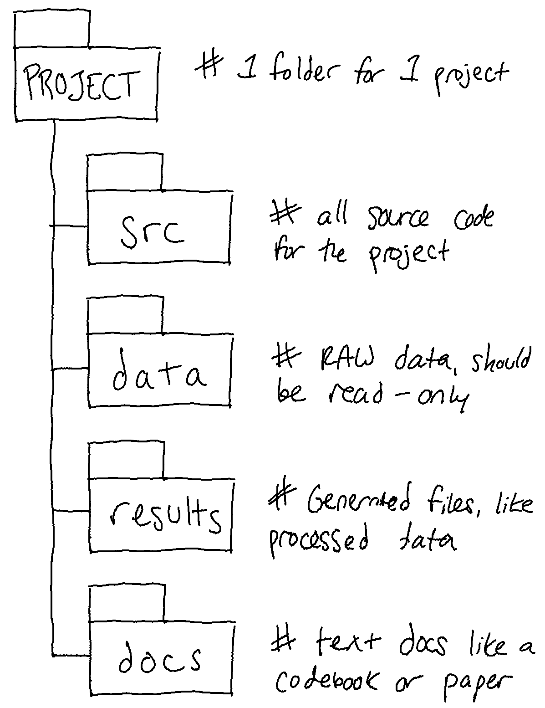
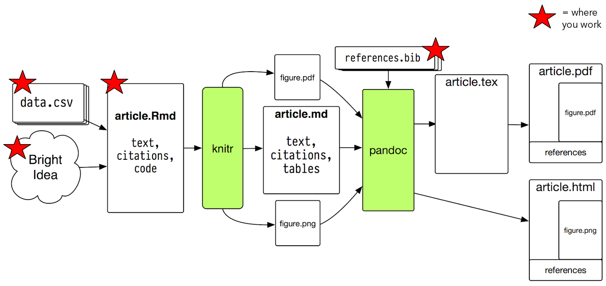
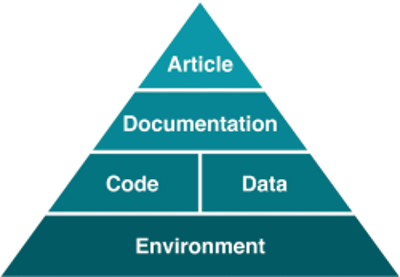
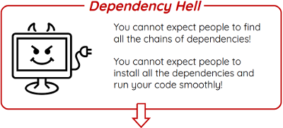

# Best Practices {-}

So I've done this lectured for at least the last four years and I'm really psyched to be here to talk to you all. I wish that research could be reproducible by default, but unfortunately the reason this workshop is necessary is because it's not; and in fact you have to frontload some work to make sure that your work 

Much of the time research workflow & processes aren't reproducible and the findings (data, code, etc.) aren't managed efficiently, and as a result, we all suffer. There are sadly many real-world examples of the repercussions of a lack of data management and reproducibility in research, and I wanted to start with a few of those examples to underscore how important this is.

For instance, this was reported in [the Atlantic](https://www.theatlantic.com/national/archive/2013/12/scientific-data-lost-forever/356422/) recently:

> A new study has found that as much as **80 percent** of the raw scientific data collected by researchers in the early 1990s is gone forever, mostly because no one knows where to find it.

**80%** of data -- gone! What's more, the study's authors found the the odds of finding a working email address for an author associated with those papers fell by about 7% per year, so it's even hard to get in touch about the datasets in general. What's even more, this is the data that likely underlies all the papers that you are reading and citing in your work. And there's no data to back up the claims! And peer reviewers didn't look at data at all back then!

Another one of the more famous data management horror stories is about a paper called [*Growth in a Time of Debt*](https://www.nber.org/papers/w15639) (it even has it's own [Wikipedia page](https://en.wikipedia.org/wiki/Growth_in_a_Time_of_Debt)!). In the study, the authors ('RR') argued that when "gross external debt reaches 60 percent of GDP", a country's annual growth declined by two percent, and "for levels of external debt in excess of 90 percent" GDP growth was "roughly cut in half." This paper influenced policies such as *Paul Ryan's Budget* (also known as the GOP's *Path to Prosperity* budget), as well as the work of economic councils in the UK and the EU.

However -- a group (HAP) led by a grad student at the University of Massachusetts at Amherst, got a copy of RR's data from the authors themselves (as they data was not published) and found that there were serious flaws in the Excel spreadsheet (coding errors, exclusion of available data from formulas, unconventional summary stats). After correcting for those errors in the spreadsheet, HAP found:

> When properly calculated, the average real GDP growth rate for countries carrying a public-debt-to-GDP ratio of over 90 percent is actually 2.2 percent, not -0.1 percent as published in Reinhart and Rogoff. [The] combination of the collapse of the empirical result that high public debt is inevitably associated with greatly reduced GDP growth and the weakness of the theoretical mechanism under current conditions, ... render the Reinhart and Rogoff point close to irrelevant for current public policy debate.

Given the festive season, I also want to link [this Twitter conversation](https://twitter.com/beeonaposy/status/1320836125053825031
) where the OP asked:

> I want to hear your SpOoOky data stories! Please share a tweet-length story (or two) of the scariest data monsters you've mashed

The replies are sometimes funny, sometimes horrifying, and weirdly enough sometimes both.

The bottom line, is we don't want these horror stories to become your personal nightmare -- research materials lost and gone forever, or research not being able to be reproduced and/or verified by colleagues. And this is why I'm here -- to provide you an overview of some practices to mitigate that risk. I'll do a broad overview of the best practices for reproducible and sustainable research, and then we'll do the hands-on portion of the class to show you all how to implement these practices for R projects in particular. 

## Research data management {-}

Let's start with a video: https://youtu.be/N2zK3sAtr-4

I want to underscore that you can't have any sort of reproducibility without good data and project management, as we see in the video! Let's first get an idea of what data is, and then some data management best practices. This definition comes to us from United States Office of Management and Budget, which means this is the definition federal funding agencies and other bodies are using: 

> the recorded factual material commonly accepted in the [research] community as necessary to validate research findings.

Many people hear 'data' and think 'spreadsheets' -- but we want to be more holistic than that in our praxis and include other important research materials under the umbrella of what we are managing. So this brings us to research data management (RDM). 

**RDM** is the process of managing the way data is collected, processed, analyzed, preserved, and published for greater reuse by *the community* and the *original researcher*. It's about making research materials findable, organized, documented, and safe, while also making the research process as efficient as possible. Here's a high level look at some of the topics encompassed in research data management:

| Data Type                      | Group Roles                                                         | Data Storage                                                      | Data Archiving                                                |
|--------------------------------|---------------------------------------------------------------------|-------------------------------------------------------------------|---------------------------------------------------------------|
| what format will the data be in? | who is primarily responsible for carrying out  RDM? | where will you store your data and how will you backup your data? | how will you preserve and make your data available to others? |

Let's go into each of these, because again to be reproducible, your research first needs to be managed. This requires some upfront work to decide on norms and workflows for RDM at the beginning of the project. However, you'll notice that this work is all front-loaded and can actually save you time overall in the course of your work! 

### Storage {-}

The bottom of the RDM pyramid is **storage**. You could have the most efficient and sensical plan and execution for research data management, but if your materials only ever exist on a USB drive...it's not good. To keep data safe, it is recommended that folks follow the 3-2-1 Rule which suggests you keep 3 copies of your data in various locations:

1. Original copy (on a laptop, desktop, etc.)
2. External hard drive in a different physical location from the original (e.g., saved to external hard drive that is periodically updated)
    * The lifetime of an external hard drive is 3-5 years! Don't forget to replace these!

3. Secure cloud service

At NYU, you have access to a few different types of storage for your work, including Google Drive (which you can mount to your local computer with Filestream), Box (for secure data needs), and [Research Workspace](https://www.nyu.edu/life/information-technology/research-and-data-support/data-management-storage.html#research-workspace) (for fast access to large data). 

Google Drive and Box have desktop applications where folks can mount and access files quickly. When downloaded and installed, the applications create a folder that appears just like a `My Documents` folder, only it's connected to your account on whatever service (so it's `Google Drive` or `Box` in your Finder). Then it operates like a two-way door: if you change something on your laptop, it'll be changed on Google Drive in-browser (for instance). If you change something in the browser (or your collaborators do), it'll be changed on  your laptop.

This helps us stick to the 3-2-1 rule pretty nicely as well: 

1. Sync data between local copies (on all my computers) and on the Google Drive server in Virginia (most likely). 
  * so this is 2 copies on 2 different storage media, with 1 copy offsite
3. Run the backup to an external hard drive over the `Google Drive` folder on my laptop whenever there are changes.
  * this brings us to 3 copies on 2 media with 1 offsite copy
  

### File Organization {-}
Once your files are stored correctly, the next low-hanging fruit is to make sure you **name your files** in a concise and efficient way. Certain choices in file naming are essential to accessing and sharing files across computing systems. Some best practices include:

+ Prefix your files with the date created using a `YYYY-MM-DD` format
+ Avoid special characters like `&`, `%`, `$`, `#`, `@`, and `*`. Just use letters and numbers.
+ Do not make file identity dependent on capitalization unless implementing camel case (e.g. `fileName.xml`).
+ Never use spaces in filenames -- many systems and software will not recognize them or will give errors unless such filenames are treated specially. Use an underscore `_` or a dash `-` instead of a space.
+ Use short file names. For your sake and the sake of systems that'll fail if you give it like a 50 character file name.

It's the difference between `VS_IMG%Archive2&3 Jan 2016.tiff` vs `2018-01-04_VS-Archive2-3.tiff`. One big note: you don't want *all* the metadata about your files in the file name, because then it can get too long and unwieldy.

There are a few solutions to help people bulk rename files to something consistent and in line with the best practices we discussed:

+ Mac:
    - In the Finder, select and highlight the files you want to change using Shift or Command. Right click/Control + click on the selected files and choose "Rename X Items". Select one of the rename options: swap out text, add a set text, or apply a custom sequential format.
    - [NameChanger](https://mrrsoftware.com/namechanger/)
+ Windows:
    - In the File Manager, select and highlight the files you want to change using Shift or Control. Right click on the selected files and choose "Rename". One of the file names will become active for editing. Enter a systematic file name and press enter. All files will be renamed using the chosen file name and numbered sequentially (1) (2), etc.
    - [Rename It!](https://sourceforge.net/projects/renameit/)

If folks don't try to put all the metadata in the their file name, they *definitely* try to put metadata in the file path and this is a big problem, especially when it comes time to share that *one* file and the path doesn't transfer across machines!

It's useful then to keep a standard way of organizing your projects alongside your file naming conventions, to help us avoid falling down the nested folder rabbit hole. This way of organizing projects I've found is one of the most helpful across different domains of research:

+ Put each `project` in its own directory, which is named after the project and perhaps prepended with that `YYYY-MM-DD` of when the project started.
+ Put text documents and relevant supplementary documentation associated with the project in the `docs` folder.
+ Put raw data and metadata in the `data` folder (which should be **ready-only**, do not change your raw data directly!)
+ Files generated during cleanup and analysis (like processed data or visualizations) in a `results` folder.
+ Put source for the project’s scripts and programs in the `src` folder.

### Documentation {-}

Once you have set up your file organization, storage, and file naming conventions, it's a good idea to think about how you will document your project. My rule of thumb is:

**If it happened during your project, chances are you need to document it!**

It's really useful when, let's say, you are trying to go back to some data from 6 months ago and you forget what it is, or why you named a variable a certain way, or you forget when it was collected. By keeping documentation such as README files (which give a high-level overview of files in a given project and how they can be used) and codebooks (files that document variables and their meaning).

For this session, we'll be working in RMarkdown, which is awesome because it means that our documentation lives alongside the code and data in a project seamlessly. RMarkdown is an extension of Markdown. It works sort of like an executable paper -- it mixes documentation & code. And not just R! You can insert code snippets from other languages (SQL, bash, Python) which makes it really useful also. You can export from `Rmd` files to a variety of different formats, like DOCX, PDF, or HTML, which makes it super useful for our context in academia, where narrative of research processes are very important.

I lightly adapted a workflow diagram made by Kieran Healy via http://plain-text.co that outlines the workflow for reproducible report writing with RMarkdown. The red stars indicate where you all would do the work, and the rest of work in that diagram is taken care of by the computer.

The great part of this is that you can do the entire research pipeline in an RMarkdown document, from data (pre-)processing to analysis and visualization. If you need to tweak a figure, all you do is update the code in RMarkdown and rebuild it, no fuss no muss!

### Formats {-}

So, you've documented your well-named files that are stored and backed up well. The next thing to look out for is the *type* of files you're generating. The goal is to work in open, well-documented, and software agnostic formats. RMarkdown, for example, is an open source format, and thought it might need R to be able to run, it can be opened in any plain text editor. These are positive indicators to me.

Some of the most common file format transformations I recommend are:

**Can anyone tell me why?**

### Recap {-}

* Follow the 3-2-1 rule for storing your data as your first RDM priority
* Structuring your project folders + naming your files consistently are two good next steps
* Move towards open formats + open tools for greater sustainability and usability of your data
* Document your work no matter what! Human memory is the most fallible thing!

## Reproducibility {-}

>  Managing your projects in a reproducible fashion doesn't just make your science reproducible, it makes your life easier. — Vince Buffalo (@vsbuffalo) [April 15, 2013](https://twitter.com/vsbuffalo/status/323638476153167872) 

Like I said, about 80-90% of reproducibility is adhering to best practices of RDM. Let's move over to talk about the best practice for reproducibility in particular for that last 20%! Before research computing, reproducibility generally meant one researcher traveling to anothers' lab or workplace to try to re-do their work. Since the widespread use of born-digital research materials, pipelines, and processes, the ability to re-do others' work is just as hard. If you have ever tried to get something to work on Windows that originally worked on macOS, you might understand why that is.

While these definitions vary across disciplines, for this session I am using the terms reproducibility and replication like so:

**Reproducibility**: independent people use the same code and data to verify a claim

**Replication**: independent people use *different* code and data (collected the same way) to verify a claim

However, as with all things, reproducibility should be defined on a spectrum. The [Stodden et al ICERM report (2013)](http://stodden.net/icerm_report.pdf) outlines these five tiers for reproducibility that I particularly like:

> Reviewable Research: Sufficient detail for peer review & assessment.  
> Replicable Research: Tools are available to duplicate the author's results using their data.  
> Confirmable Research: Main conclusions can be attained independently without author's software.  
> Auditable Research: Process & tools archived such that it can be defended later if necessary.  
> **Open/Reproducible Research: Auditable research made openly available**  

This spectrum definition also harkens back to one of the other most said quotes about reproducibility, which I think is important to think about going back to the idea of thinking of data managemnt holistically to cover everything needed to validate your work:

> An article about computational results is advertising, not scholarship. The actual scholarship is the full software environment, code and data, that produced the result. -- Johnathan Buckheit and David Donoho, Stanford University

I also think these definitions can therefore be mapped onto some real-world examples like so:

| ICERM Report Definitions                                                                       | Potential Real-World Examples                                                                                                  |
|:-----------------------------------------------------------------------------------------------|:-------------------------------------------------------------------------------------------------------------------------------|
| Reviewable Research: Sufficient detail for peer review & assessment                            | the code and data are openly available                                                                                         |
| Replicable Research: Tools are available to duplicate the author’s results using their data    | the tools (software) used in the analysis are freely available for others to confirm results                                   |
| Confirmable Research: Main conclusions can be attained independently without author’s software | other can reach the conclusion using similar tools, not necessarily the same as the author, or on a different operating system |
| Auditable Research: Process & tools archived such that it can be defended later if necessary   | The tools, environment, data, and code are put into a preservation-ready format                                                |
| Open/Reproducible Research: Auditable research made openly available                           | Everything above is made available in a repository for others to examine and use                                               |

I also like to think of the requrements to get to open and reproducible research as this pyramid of things to manage:

The idea is that we need the whole pyramid for research reproducibility. So the goal becomes to capture the whole pyramid -- the code, data, documentation, narrative, and the computational environment (like operating systems and programming language dependencies with their various configurations). We can do this with RMarkdown and a few R packages, which we'll see in the hands-on.  We call the idea of making this process reproducible **computational reproducibility**. 

But first --  **why do we care about reproducibility?**

There are many reasons to support reproducibility in research, including:

+ **Build on top of previous work** – after all, research is incremental and we always rely and base ourselves in methods and techniques developed in the past.
    - Y’know. That Sir Isaac Newton quote in every reproducibility presentation ever: "If I have seen further, it is by standing on the shoulders of giants."
+ **Help newcomers** learn methods and norms of the field through reproducing others' work.
    - It's always a struggle to make things work when there's not enough detail or the right code/data to keep a project going. 
+ **Defeat self-deception**, which is in line with verifying the correctness of results.
    - This is not a matter of researchers not trusting each other -- the issue is that even an honest person is a master of self-deception. Often, we are trying to find reasonable and acceptable outcomes to meet a certain deadline.
    - A very common fallacy in research, for instance, is to rigorously check the unexpected results but give expected results a free pass. Inviting others to reproduce your work and be the devil's advocate is a great way to verify if you are following the right path.
+ Others can **re-use and extend your work** more easily! You can even find interesting collaborations and future research projects out of this.
+ **YOU can re-use and extend your work more easily**! Future you is your greatest collaborator (and past you doesn't answer emails!)

**Ok, so we care about reproducibility. It's so hard, though!**

Yes, achieving that 100% reproducibility mark is hard. This is in part due to 3 major challenges:

1. **Workload & Time Challenges**: it is a time commitment to get data and code ready to share, and to share it 
    + the *Incentive Problem*: reproducibility takes time, and is not always valued by the academic reward structure

> "Insufficient time is the main reason why scientists do not make their data and experiment available and reproducible." - Carol Tenopir, Beyond the PDF2 Conference

> "77% claim that they do not have time to document and clean up the code." -- Victoria Stodden, Survey of the Machine Learning Community – NIPS 2010

2. **Technical Obsolescence**: technology changes affect the reproducibility  
    + the *Pipeline Problem*: reproducibility requires skills that are often not included in most curricula!

> "It would require huge amount of effort to make our code work with the latest versions of these tools." -- Collberg et al., Repeatability and Benefaction in Computer Systems Research, University of Arizona TR 14-04

Like I mentioned before, good research data management practices enables reproducibility but does not *guarantee* it. Open file formats, good documentation, using open tools, and backing up your data is amazing and necessary, but even that isn't enough to ensure that I can rerun your work. That's computational reproducibility is about. What works on my Linux machine should give the same results when run on your macOS laptop. This phenomenon has been explored in publications such as: 

[**The Effects of FreeSurfer Version, Workstation Type, and Macintosh Operating System Version on Anatomical Volume and Cortical Thickness Measurements**](https://dx.doi.org/10.1371/journal.pone.0038234)

> We investigated the effects of data processing variables such as FreeSurfer version (v4.3.1, v4.5.0, and v5.0.0), workstation (Macintosh and Hewlett-Packard), and Macintosh operating system version (OSX 10.5 and OSX 10.6). **Significant differences** were revealed between FreeSurfer version **v5.0.0 and the two earlier versions**. [...] About a factor two *smaller differences* were detected between *Macintosh and Hewlett-Packard* workstations and between *OSX 10.5 and OSX 10.6*.

**The challenge: environments are hard to capture**

**Gap**: tools that can automatically capture all the dependencies in the original environment in a research compendium and automatically set them up in another environment. There are a few tools that try to address this gap in slightly different ways:

*Containers*: lightweight virtual operating systems you can send around to other people.

+ [Singularity](https://www.sylabs.io/docs/) (made for & popular in high performance computing)
    - Starting a Singularity container "swaps" out the host operating system environment for one the user controls -- instantly virtualize the operating system, without having root access, and allow you to run that application in its native environment!

+ [Docker](https://docker.com)
    - Docker was made to "pack, ship and run any application as a lightweight container." -- idea is to provide a comprehensive abstraction layer that allows developers to "containerize" or "package" any application and have it run on any infrastructure (doesn't really work on HPC though...).

*Packaging Systems*: auto-capture of dependencies & source code used at time of running.

+ [ReproZip](https://reprozip.org) (I work on this!)
    - Open source tool that automatically captures provenance of research and packs all the necessary files, library dependencies, and variables to reproduce the results. Anyone can then unpack and reproduce the research without having to install any additional software!

+ [o2r](https://o2r.info)
    - Give them a R workspace with an RMarkdown file, get a re-runnable paper in-browser. Uses docker to do this in the backend.
    
**R-specific packages**: R packages made to facilitate sharing of computationally reproducible research

+ [renv](https://rstudio.github.io/renv/): `renv` is an R package to create portable, reproducible environments for R projects.

+ [rrtools](https://www.rdocumentation.org/packages/rrtools/versions/0.1.0): more of a data management package, `rrtools` provides instructions, templates, and functions for writing a reproducible journal article.

The goal is: at the end of a project, take all the great data and project management skills and make what's called a *research compendium* or a *reproducible package* of all your work! This is a package that contains all of the things necessary to reproduce your work, taking even the computational environment into account. We'll be doing that with RMarkdown and `renv` next.

## Recap {-}

+ Good data management is necessary for reproducibility, but doesn't guarantee it
+ You can work reproducibly in many ways -- your data cleaning work can be somewhat reproducible, the analysis fully reproducible, or data collection not at all reproducible. It's a spectrum
+ Introduce reproducible workflows in small bits, get comfortable, and expand.
+ Open formats & open tools enable more reproducibility. Use them!

## Further Reading {-}

* Barba-group reproducibility syllabus: https://hackernoon.com/barba-group-reproducibility-syllabus-e3757ee635cf
* Ten Simple Rules for Reproducible Computational Research: http://journals.plos.org/ploscompbiol/article?id=10.1371/journal.pcbi.1003285
* Five selfish reasons to work reproducibly: https://genomebiology.biomedcentral.com/articles/10.1186/s13059-015-0850-7
* How scientists fool themselves – and how they can stop: https://www.nature.com/news/how-scientists-fool-themselves-and-how-they-can-stop-1.18517 
* Gitlab-CI for R packages: https://gitlab.com/jangorecki/r.gitlab.ci  && https://bertelsen.ca/example-gitlab-ci-yml-for-r-projects/
